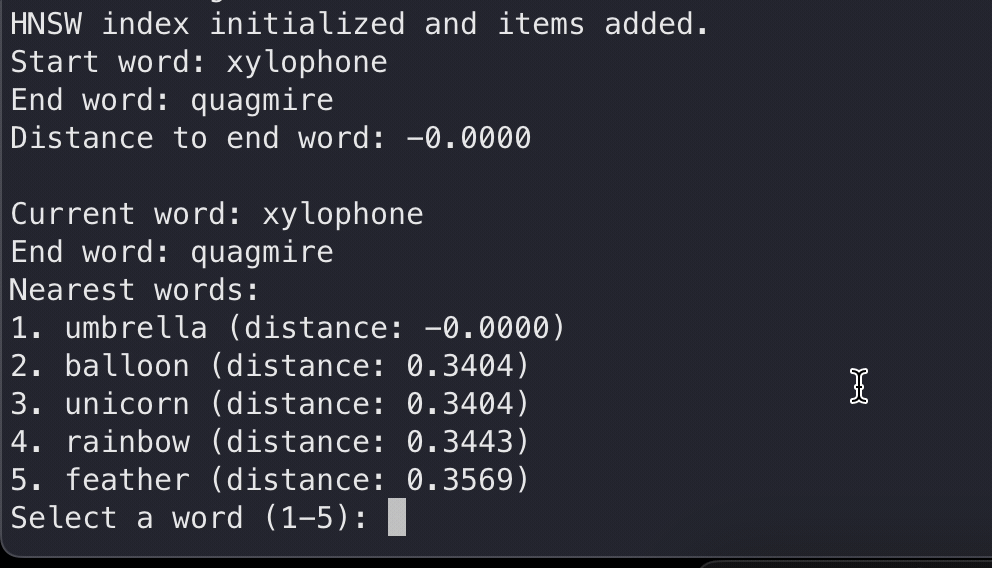

# Walker: Word Embedding Search

This project implements a word embedding game similar to [The Wikipedia Game](https://www.thewikipediagame.com/) (race from one page to another), except instead of Wikipedia you are traversing a word embeddings space. The game starts with a randomly selected start word and end word from a dictionary. The user navigates from the start word to the end word by selecting the nearest words in each turn.

## Setup

### Prerequisites

- Python 3.6 or higher
- `pip` (Python package installer)

### Installation

1. Clone the repository or download the script files.

2. Navigate to the project directory.

3. Install the required Python packages using `pip`:
